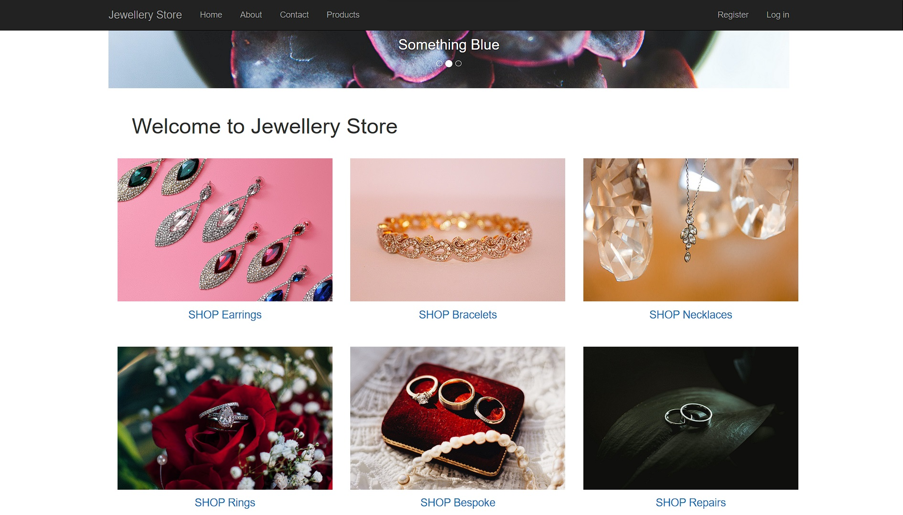
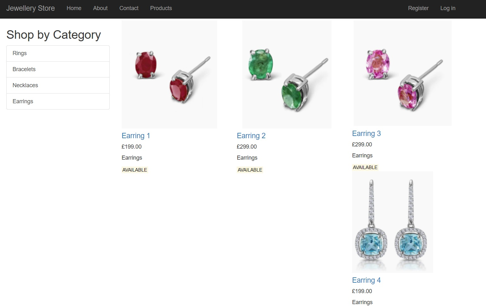
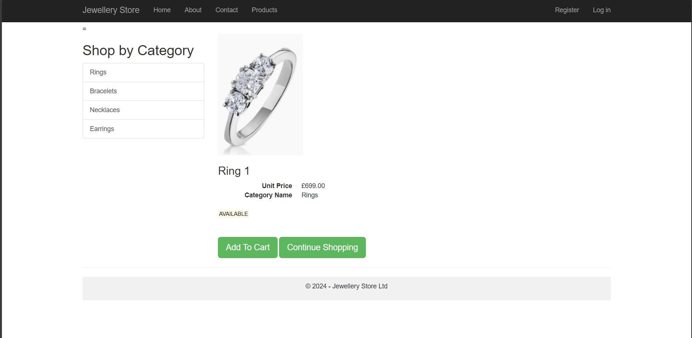
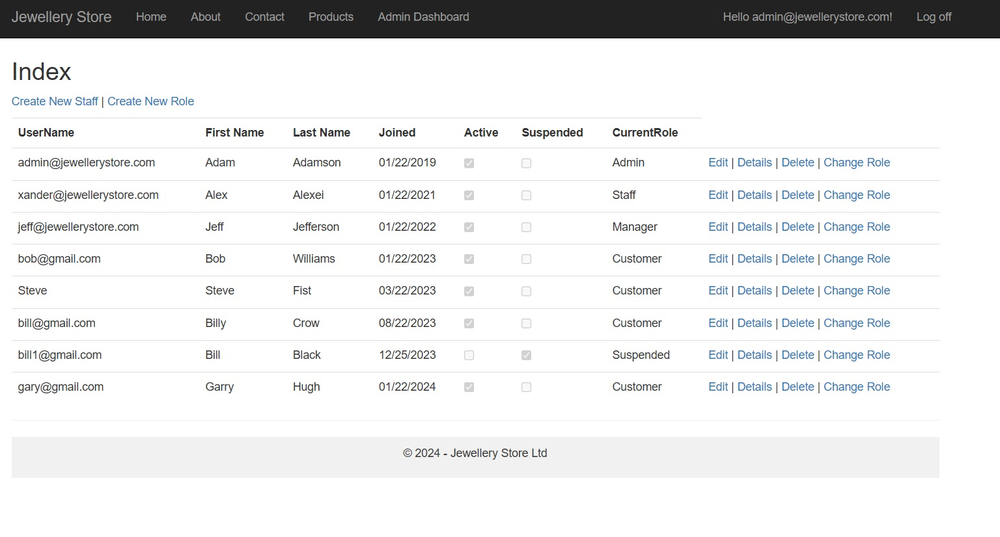

# Project Title
Jewelry shop
## Description
This is a website project where an user can select a range of products and add them to a basket. The project is still under development.

## Features / Functionalities
- As a customer:
    - Registration
    - Product selection
    - Checkout (no real money transaction involved)

- As a Manager:

    - Creating, editing or deleting products.
    - Creating and deleting staff users.
    - Report management and creation

### Programming language used
- The project has been developed using C# and Asp.NET Core.

## License
This project is not licensed for reuse, modification, or distribution.

## Contact
- Full name: Manuele Tacchetti
- Email: manuele.tacchetti@gmail.com

